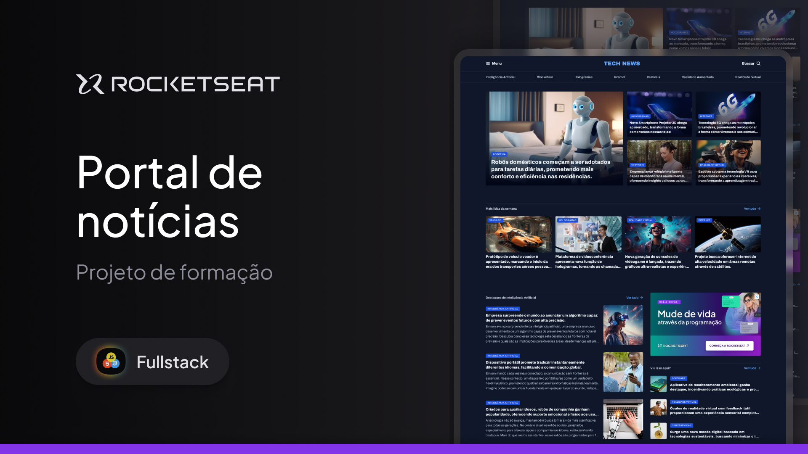

<h1 align="center">Portal de notícias</h1>

Boas-vindas ao projeto Portal de notícias  

  <a href="#-tecnologias">Tecnologias</a>&nbsp;&nbsp;&nbsp;|&nbsp;&nbsp;&nbsp;
  <a href="#-projeto">Projeto</a>&nbsp;&nbsp;&nbsp;|&nbsp;&nbsp;&nbsp;
  <a href="#memo-licença">Licença</a>

  

 

  

## 🚀 Tecnologias

Esse projeto foi desenvolvido com as seguintes tecnologias:

- HTML e CSS
- Git e Github
- Figma

## 💻 Projeto

Neste projeto desenvolvo a homepage de um portal de notícias sobre tecnologia para ser visualizado em um desktop. 
Este projecto foi desenvolvido com o objectivo de aplicar os conhecimentos do GRID aprendendido durante as aulas na formação Full-Stack  na Rocketseat

## :memo: Licença

Esse projeto está sob a licença MIT.

---

Feito com ♥ by Paulo Nachava
